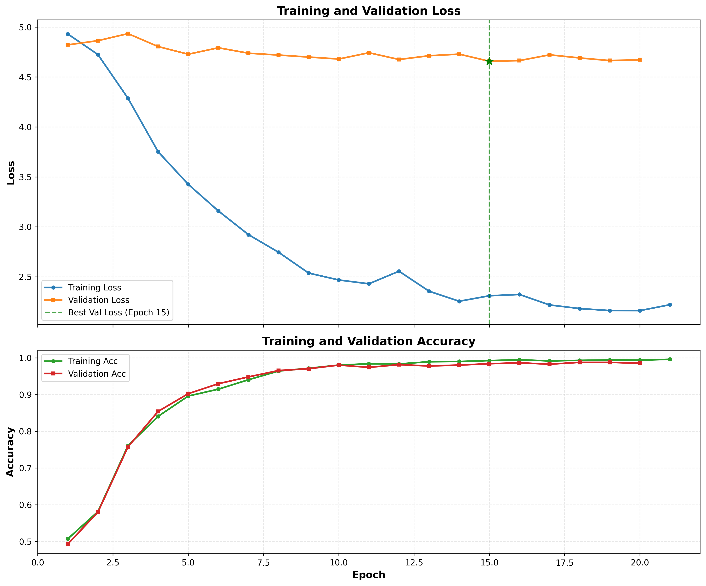

# Weld-Anomaly-Detection

## 一句话总结

**V5 (Causal-FiLM)**: 无监督异常检测 - 因果分层融合与传感器调制，仅用正常样本训练，通过重建误差检测异常。

**V4 (SupCon)**: 四模态深度融合 - 冻结三类预训练视觉/音频 backbone（视频/图像/音频），训练可学习的传感器编码器与 Cross-Attention 融合头，采用 Supervised Contrastive Loss + 下游分类/检测头微调。

---

## 🆕 V5更新: Causal-FiLM模型

### 核心架构

**Causal-FiLM** = **L0**(冻结Backbone) + **L1**(FiLM调制) + **L2**(因果编码) + **L3**(反泛化解码) + **L4**(复合损失)

```
传感器数据 → SensorModulator → gamma/beta
                                    ↓ (FiLM调制)
视频/音频 → V-JEPA/AST → 特征 → ProcessEncoder → Z_process
                                                      ↓ (解码)
焊后图像 → DINOv2 → 特征 → ResultEncoder → Z_result ← Z_result_pred
                                              ↓ (比较)
                                        异常分数 = 1 - cos_sim + 10 * L1
```

### 详细组件说明

#### 1. L0: 冻结特征提取器 (Frozen Backbones)
- **Video**: `V-JEPA` (vit-based, 1024 dim), 冻结。投影至 256 维。
- **Audio**: `AST` (Audio Spectrogram Transformer, 768 dim), 冻结。投影至 256 维。
- **Image**: `DINOv2` (ViT-Base, 768 dim), 冻结。提取 Layer 12 (Mean Pool) 和 Layer 8 (Max Pool) 特征。
- **Sensor**: 原始 6 通道时间序列数据。

#### 2. L1: FiLM 传感器调制 (Sensor Modulation)
- **SensorModulator**: 
  - 输入: 6 通道传感器数据
  - 结构: GRU/LSTM -> MLP -> 输出 `gamma`, `beta` (1, 256)
  - 作用: 生成全局上下文仿射变换参数
- **调制操作**: $F_{mod} = F \cdot \gamma + \beta$
  - 应用于视频和音频特征，注入工艺参数上下文。

#### 3. L2: 因果分层编码器 (Causal Encoders)
- **ProcessEncoder (过程编码)**:
  - 输入: 调制后的视频 (Query) 和音频 (Key/Value)
  - 结构: 2层 Cross-Attention Transformer, 4 Heads
  - 输出: `Z_process` (256 dim)
  - 逻辑: 视频关注音频，捕捉焊接过程中的声光交互。
- **RobustResultEncoder (结果编码)**:
  - 输入: DINOv2 的 Layer 12 (结构语义) 和 Layer 8 (纹理细节)
  - 结构: 
    - 独立 LayerNorm: 分别归一化 L12 和 L8 特征
    - 拼接: Concat(L12, L8) -> 1536 dim
    - 投影: MLP (1536 -> 512 -> ReLU -> 256)
  - 输出: `Z_result` (256 dim)
  - 逻辑: 融合高层语义与底层纹理，增强对微小裂纹的敏感度。

#### 4. L3: 反泛化解码器 (Anti-Generalization Decoder)
- **AntiGenDecoder**:
  - 输入: `Z_process`
  - 结构: 单流 MLP (256 -> 256)
  - 输出: `Z_result_pred`
  - 逻辑: 仅通过过程特征预测结果特征。由于仅在正常样本上训练，模型无法预测异常过程产生的结果，从而产生高重建误差。

#### 5. L4: 复合损失函数 (Loss Function)
- **CausalFILMLoss**:
  - **Cosine Distance**: $1 - \text{cosine\_similarity}(Z_{result}, Z_{pred})$ (关注方向一致性)
  - **L1 Distance**: $\text{mean}(|Z_{result} - Z_{pred}|)$ (关注强度差异，权重 10.0)
  - **CLIP Text Constraint**: 强制 $Z_{pred}$ 与 "a normal weld" 的 CLIP 嵌入对齐 (权重 0.1)
  - **总损失**: $L_{total} = L_{cos} + 10.0 \cdot L_{L1} + 0.1 \cdot L_{text}$

### 训练配置 (Training Config)

- **优化器**: AdamW
  - Learning Rate: 1e-4
  - Weight Decay: 1e-4
  - Betas: (0.9, 0.999)
- **调度器**: Cosine Annealing with Warmup
  - Warmup Epochs: 2
  - Warmup Start LR: 1e-6
  - Min LR: 1e-7
- **超参数**:
  - Batch Size: 32
  - Epochs: 100
  - `d_model`: 256
  - Early Stopping: Patience 8 (监控 `val_auroc`)

### 快速使用

```bash
# 训练 (仅用正常样本)
bash scripts/train_causal_film.sh

# 评估
bash scripts/evaluate_causal_film.sh /root/autodl-tmp/outputs/checkpoints/best_model.pth
```

**关键创新**:
- ✅ 传感器作为上下文（FiLM调制），而非直接融合
- ✅ 因果分层：显式建模"过程→结果"
- ✅ RobustResultEncoder：双层特征融合 (L12+L8) 捕捉细微缺陷
- ✅ L1 Loss 主导：增强对异常强度的敏感性

详见：`README_v2.md`（技术方案）、`docs/CHANGELOG.md`（实现细节）、`docs/QUICKSTART.md`（使用指南）

---

## 🆕 Late Fusion Strategy (Plan E + Video AE)

为了进一步提升SOTA性能，我们引入了**Late Fusion**策略，结合Causal-FiLM模型与专用的Video Autoencoder。

### 核心思想
- **Model A (Causal-FiLM)**: 负责捕捉过程与结果的因果违规（Cracks等）。
- **Model B (Video AE)**: 负责捕捉视频/图像中的外观异常（Convexity等）。
- **Fusion**: 对两者的异常分数进行标准化（Z-score），然后相加。

### 快速使用

```bash
# 1. 训练 Video Autoencoder
bash scripts/train_video_ae.sh

# 2. 评估融合模型 (需已有 Causal-FiLM 权重)
bash scripts/evaluate_fusion.sh
```

---

## V4架构: SupCon模型

### 合同（Inputs / Outputs / 错误模式）
- 输入：字典形式的四模态样本 {
  - `video`: Tensor (B, T, 1, H, W) — 采样帧数 T，单通道（灰度）
  - `post_images`: Tensor (B, N, 3, H, W) — N 个多角度静态图
  - `audio`: Tensor (B, C, L) 或 Mel (B, 1, M, F)
  - `sensors`: Tensor (B, S, F_s) — 多通道时间序列
  - `label`: int 或 Tensor (B,) 
- 输出：{
  - `features`: Tensor (B, D_fusion) — 融合特征
  - `logits`: Tensor (B, num_classes)
  - `anomaly_score`(可选)：float 或 Tensor (B,)
}
- 常见错误模式：模态不同步/长度不一致、后处理未归一化、部分模态缺失未按 mask 处理。

## 模型详细架构（分块描述）
### 1) Backbones（冻结为主）
- **VideoEncoder: V-JEPA（vit-based）**
  - **模型**: `facebook/vjepa2-vitl-fpc64-256`
  - **输入**: Tensor (B, T, 1, H, W) — 采样帧数 T（默认8），单通道灰度视频
  - **预训练数据集**: 无标签视频（自监督学习）
  - **输出**: 时空特征序列 (B, T', Dv) — T'≈16, Dv=1024
  - **冻结策略**: 冻结大部分参数，仅允许最后投影层/adapter学习
  - **实现细节**: 使用Hugging Face transformers加载，特征提取后通过线性投影到统一维度

- **ImageEncoder: DINOv2**
  - **模型**: `facebook/dinov2-base`
  - **输入**: Tensor (B, N, 3, H, W) — N个多角度静态图（默认5），RGB格式
  - **预训练数据集**: 无标签图片（自监督学习）
  - **输出**: (B, N, Di) — Di=768，每个角度独立编码
  - **冻结策略**: 完全冻结backbone参数
  - **聚合方式**: 支持mean/max/concat聚合多角度特征

- **AudioEncoder: AST (或可替换为 Wav2Vec2/Audioset 变体)**
  - **模型**: `MIT/ast-finetuned-audioset-14-14-0.443`
  - **输入**: Tensor (B, C, H, W) — Mel频谱图，C=1, H=64（mel bins）, W=32（时间帧）
  - **预训练数据集**: AudioSet（通用音频事件）
  - **输出**: (B, Da) — Da=768，全局音频特征
  - **冻结策略**: 冻结backbone参数
  - **音频预处理**: 16kHz重采样，128 mel bins，25ms hop length

- **SensorEncoder: TransformerEncoder（从零训练）**
  - **架构**: PyTorch标准TransformerEncoder
  - **输入**: Tensor (B, S, F_s) — 时间序列，S=128（时间步），F_s=6（传感器通道）
  - **输出**: 时序特征 (B, S', Ds) — S'≈32, Ds=256
  - **超参数**:
    - num_layers: 4
    - num_heads: 8
    - dim_feedforward: 1024
    - dropout: 0.1
  - **训练策略**: 全量训练（从零开始）

### 2) Cross-Attention Fusion Module（Trainable）
- **核心机制**: 多头交叉注意力融合四路模态特征
- **架构**:
  1. **学习融合tokens**: 初始化可学习查询向量（num_fusion_tokens=4, hidden_dim=512）
  2. **模态投影**: 将各模态特征投影到统一hidden_dim（512）
  3. **交叉注意力**: 融合tokens作为查询，分别与视频/图像/音频/传感器特征交互
  4. **残差连接**: LayerNorm + 残差（queries + attended_output）
  5. **聚合**: 拼接所有attended特征 → 线性聚合 → 最终投影
- **注意力公式**:
  ```
  Attention(Q, K, V) = softmax(QK^T / √d_k) V
  其中Q=融合tokens, K/V=各模态投影特征
  ```
- **输出**: 融合向量 D_fusion=512
- **可解释性**: 支持返回注意力权重，用于分析模态重要性

### 3) Heads
- **SupCon Projection Head（用于对比学习）**:
  - **架构**: 2-layer MLP → L2正则化
  - **公式**: features → Linear(512→512) → ReLU → Linear(512→512) → L2_norm
  - **目的**: 学习判别性特征空间

- **分类 Head / 异常评分 Head**:
  - **架构**: 单层或两层MLP输出logits/score
  - **公式**: features → Linear(512→num_classes) 或 Linear(512→1)
  - **激活**: 无（直接输出logits）或Sigmoid（异常评分）

## 训练与微调策略（实用配置）
### 优化器配置
- **推荐优化器**: AdamW
- **学习率设置**:
  - Backbone: 0（冻结）或 1e-6（微调）
  - Fusion模块: 1e-4
  - Heads: 1e-4
- **权重衰减**: 1e-4（L2正则化）
- **AdamW超参数**:
  - betas: (0.9, 0.999)
  - eps: 1e-8

### Batch Size与显存
- **建议batch_size**: 2-16（受显存限制）
- **梯度累积**: 当batch_size<8时使用，累积2-4步
- **显存优化**: 使用梯度检查点（activation checkpointing）

### 混合精度训练（AMP）
- **推荐启用**: torch.cuda.amp
- **优势**: 减少显存使用，加速训练
- **实现**: GradScaler + autocast

### 学习率调度器
- **推荐调度器**: CosineAnnealingLR + Warmup
- **配置**:
  - warmup_epochs: 5-10
  - warmup_start_lr: 1e-7
  - T_max: total_epochs - warmup_epochs
  - eta_min: 1e-6
- **公式**:
  ```
  lr = eta_min + 0.5 * (base_lr - eta_min) * (1 + cos(π * step / T_max))
  ```

### 冻结策略
- **默认**: 冻结所有backbone（Video/Image/Audio）
- **实验选项**:
  - 解冻最后1-3层: 适用于领域适应
  - 使用Adapters/LoRA: 减少可训练参数
- **SensorEncoder**: 始终全量训练

### 损失函数详解
#### Supervised Contrastive Loss (SupConLoss)
- **核心思想**: 拉近同类样本，推远异类样本
- **公式**:
  ```
  L = (1/N) * Σ_i [- (τ/base_τ) * log( exp(z_i·z_j^+ / τ) / Σ_k exp(z_i·z_k / τ) )]
  其中z_i·z_j^+为正对，τ=0.07为温度参数
  ```
- **优势**: 无需大量负样本，适合小batch_size
- **实现细节**: 特征L2归一化，数值稳定性处理

#### Combined Loss (可选)
- **组合**: SupConLoss + CrossEntropy Loss
- **权重**: supcon_weight=1.0, ce_weight=0.1
- **适用场景**: 同时优化特征学习和分类性能

### 数据增强策略
- **训练时启用**: 随机裁剪、翻转、颜色抖动、MixUp
- **验证时禁用**: 仅标准化变换
- **MixUp**: 在特征层面应用，alpha=0.2

### 检查点与早停
- **保存策略**: 按验证损失保存最佳模型
- **早停**: patience=10，无改善则停止
- **周期保存**: 每5个epoch保存最近模型

## 数据管线要点
### 视频处理
- **采样策略**: 均匀采样T=8帧，避免temporal bias
- **预处理步骤**:
  1. 读取视频文件（.avi/.mp4）或图像文件夹
  2. 转换为灰度（单通道）
  3. Resize到224x224
  4. 标准化：mean=0.5, std=0.5
- **代码示例**:
  ```python
  import cv2
  # 采样帧索引
  total_frames = cap.get(cv2.CAP_PROP_FRAME_COUNT)
  indices = [int(i * (total_frames-1) / (num_frames-1)) for i in range(num_frames)]
  # 读取并预处理
  frames = []
  for idx in indices:
      cap.set(cv2.CAP_PROP_POS_FRAMES, idx)
      ret, frame = cap.read()
      if ret:
          frame = cv2.cvtColor(frame, cv2.COLOR_BGR2GRAY)
          frame = cv2.resize(frame, (224, 224))
          frame = frame.astype(np.float32) / 255.0
          frame = (frame - 0.5) / 0.5  # 标准化
          frames.append(frame)
  ```

### 图像处理
- **多角度输入**: 读取5个角度的静态图片
- **预处理步骤**:
  1. 读取RGB图片
  2. Resize到224x224
  3. 标准化：ImageNet均值和方差
  4. 堆叠成(N, 3, H, W)
- **缺失处理**: 角度不足时重复最后一个角度
- **代码示例**:
  ```python
  import cv2
  images = []
  for img_path in img_files[:num_angles]:
      img = cv2.imread(img_path)
      img = cv2.cvtColor(img, cv2.COLOR_BGR2RGB)
      img = cv2.resize(img, (224, 224))
      img = img.astype(np.float32) / 255.0
      # ImageNet标准化
      img = (img - np.array([0.485, 0.456, 0.406])) / np.array([0.229, 0.224, 0.225])
      images.append(img)
  images = np.stack(images, axis=0).transpose(0, 3, 1, 2)  # (N, C, H, W)
  ```

### 音频处理
- **预处理流程**:
  1. 加载音频文件（.wav/.flac）
  2. 重采样到16kHz
  3. 计算Mel频谱图：128 mel bins, 25ms hop
  4. 截断/填充到固定长度（32帧）
- **库依赖**: librosa, soundfile
- **代码示例**:
  ```python
  import librosa
  y, sr = librosa.load(audio_path, sr=16000)
  mel = librosa.feature.melspectrogram(y=y, sr=sr, n_mels=128, hop_length=400)
  mel_db = librosa.power_to_db(mel, ref=np.max)
  # 截断或填充
  if mel_db.shape[1] > audio_frames:
      mel_db = mel_db[:, :audio_frames]
  else:
      pad_width = audio_frames - mel_db.shape[1]
      mel_db = np.pad(mel_db, ((0,0), (0, pad_width)), mode='constant')
  ```

### 传感器数据处理
- **数据格式**: CSV文件，多列数值传感器读数
- **预处理步骤**:
  1. 读取所有数值列
  2. 时间序列插值到固定长度（128步）
  3. Z-score标准化：(x - mean) / std
  4. 选择前6个通道（或填充）
- **插值方法**: 线性插值处理缺失值
- **代码示例**:
  ```python
  import pandas as pd
  df = pd.read_csv(csv_path)
  numeric_cols = df.select_dtypes(include=[np.number]).columns
  data = df[numeric_cols].values  # (T, C)
  # 插值到固定长度
  from scipy import interpolate
  x_old = np.linspace(0, 1, len(data))
  x_new = np.linspace(0, 1, sensor_len)
  interp_func = interpolate.interp1d(x_old, data, axis=0, kind='linear', 
                                     bounds_error=False, fill_value='extrapolate')
  data_interp = interp_func(x_new)
  # Z-score标准化
  mean = data_interp.mean(axis=0, keepdims=True)
  std = data_interp.std(axis=0, keepdims=True)
  std = np.where(std == 0, 1, std)  # 避免除零
  data_norm = (data_interp - mean) / std
  ```

### 数据集划分
- **策略**: 使用manifest.csv进行TRAIN/TEST划分
- **避免泄露**: 确保样本不重叠
- **平衡性**: StratifiedBatchSampler保证batch内类别平衡

## 评估协议（可复现）
### 特征库 + k-NN 分类
- **构建特征库**:
  1. 使用训练集数据通过完整模型提取特征
  2. 保存特征向量和对应标签
  3. 特征维度: 512 (L2归一化后)
- **推理过程**:
  1. 提取测试样本特征
  2. 计算与特征库的余弦相似度
  3. 使用k-NN (k=5)进行分类
- **代码示例**:
  ```python
  from sklearn.neighbors import KNeighborsClassifier
  # 构建特征库
  train_features = []  # 从训练集中提取
  train_labels = []
  # 训练k-NN分类器
  knn = KNeighborsClassifier(n_neighbors=5, metric='cosine')
  knn.fit(train_features, train_labels)
  # 预测
  test_pred = knn.predict(test_features)
  ```

### 评估指标
- **分类指标**:
  - Accuracy: 整体准确率
  - Macro F1: 各类别F1的平均值
  - Per-class F1: 每个类别的F1分数
- **异常检测指标**:
  - AUROC: 异常样本的ROC曲线面积
  - AUPRC: 精确率-召回率曲线面积
- **计算方式**:
  ```python
  from sklearn.metrics import accuracy_score, f1_score, roc_auc_score
  accuracy = accuracy_score(y_true, y_pred)
  macro_f1 = f1_score(y_true, y_pred, average='macro')
  per_class_f1 = f1_score(y_true, y_pred, average=None)
  # 对于异常检测，使用异常类别的概率
  auroc = roc_auc_score(y_true_binary, y_scores)
  ```

### 快速验证（过拟合测试）
- **测试方法**: 用少量样本（每类2个）训练
- **预期结果**: 训练集准确率接近100%
- **目的**: 验证模型架构和训练流程无bug

### 基线对比实验
- **A. 论文复现基线**: Audio 1D CNN-AE + Video Slowfast-AE，后期分数融合
- **B. 单模态SOTA基线**: 各模态独立使用SOTA编码器
- **C. 简单融合基线**: 特征拼接 + MLP融合
- **D. 最终模型**: Cross-Attention深度融合
- **评估**: 量化报告每组基线的F1/AUROC提升

## 优化与创新建议（按优先级，短句直接可落地）
1) 轻量微调优先：Adapters/LoRA 替代全量微调，极大减少可训练参数且易部署。
2) 时序对齐器：显式学习视频/传感器/音频的时间对齐（cross-modal temporal attention），减少模态错位误差。
3) 对比挖掘策略：采用困难负样本采样（hard negative mining）提升 SupCon 效果。
4) 半/自监督预训练：对本域无标签视频/音频做短期自监督（SimCLR/MAE 式）再微调。
5) 多任务头：同时训练分类 + 重建（或预测下步传感器），提升泛化与鲁棒性。
6) 校准与不确定量化：用温度缩放与贝叶斯后处理（MC Dropout 或 DeepEnsemble）获得可靠异常置信度。
7) 推理优化：动态量化 + 剪枝 + TorchScript 导出，确保工业部署延迟可控。
8) 可解释性：为图像/视频加入 GradCAM / attention 可视化，辅助工程师定位缺陷源。
9) 数据增强：针对焊接场景的合成瑕疵样本与时间域扰动增强，缓解类不平衡。
10) 融合探索：比较 Late Fusion vs Mid Fusion vs Cross-Attention（定量报告每项对 F1/AUROC 的影响）。


**最后一次运行的结果**：说实话挺令人疑惑的，疑似过拟合但acc没有提升空间了。暂时这样吧。已经调参许久了。

## 总结
大创TODO: 
控制部分：
- 实现

缺陷检测部分（当前）：
- 模块创新：方案确定和实施
- baseline复现
- 成果转化(可选): 具体工作量参考论文 Cross-Modal Learning for Anomaly Detection in Complex Industrial Process: Methodology and Benchmark, b刊1区，带benchmark，复现了10多个baseline
----------------------------------------------------------------------

# 详细技术方案与实现路径

## 基线设计与对比实验（Baselines & Ablations）

| 类别 (Category) | 模型/基线名称 (Model/Baseline Name) | 核心技术 (Core Technology) | 实验目的 / 对比对象 (Experimental Purpose / Comparison Target) |
| :--- | :--- | :--- | :--- |
| **A. 论文复现基线**<br>(Paper Reproduction) | `Paper-Baseline (Reproduced)` | Audio 1D CNN-AE + Video Slowfast-AE，然后进行后期分数融合 (Late Fusion) 。 | **最重要的基准**。验证您的实验环境，并提供一个必须超越的、最直接的性能参照点。 |
| **B. 单模态SOTA基线**<br>(Single-Modality SOTA) | `In-Process-Video-Only` | **V-JEPA (Fine-tuned)**: 微调用于实时黑白视频的自监督时空特征提取器。 | 证明先进的自监督视频编码器在过程监控中的优势。 |
| | `Post-Weld-Image-Only` | **DINOv2 (Fine-tuned)**: 微调用于焊后多角度静态图片的自监督外观特征提取器。 | **衡量新模态的独立贡献**。证明最终成品外观本身就包含了丰富的缺陷信息。 |
| | `Audio-Only` | **AST (Fine-tuned)**: 微调用于音频信号的事件特征提取器。 | 对比`Paper-Baseline`的音频部分，证明更先进的音频编码器能带来提升。 |
| | `Sensor-Only` | **Transformer Encoder**: 仅使用`.csv`数据的时间序列特征提取。 | 证明传感器数据本身就包含有效的缺陷信息，是您工作的创新点之一。 |
| **C. 简单融合基线**<br>(Simple Fusion) | `SOTA-Late-Fusion` | 将B组中**四个**SOTA模型的异常分数进行后期加权融合。 | 对比`Paper-Baseline`，证明即使只用简单的后期融合，采用SOTA编码器和新增模态也能大幅提升性能。 |
| | `SOTA-Mid-Fusion` | 将B组中**四个**SOTA模型提取的特征向量进行拼接（Concatenate），再通过MLP进行融合。 | **证明中层特征融合的价值**。对比`SOTA-Late-Fusion`，展示在特征层面进行融合优于在分数层面融合。 |
| **D. 最终提出的SOTA模型**<br>(Proposed SOTA Model) | `Proposed-Deep-Fusion` (您的模型) | **冻结Backbone并微调头部**：采用交叉注意力机制（Cross-Attention）对**四个**SOTA模态的特征进行深度、动态的融合。 | **核心贡献**。对比所有A, B, C组基线，特别是`SOTA-Mid-Fusion`，证明您的深度融合策略能够最有效地利用过程与结果的多模态信息，实现最佳性能。 |

### 技术方案：基于微调的监督对比学习四模态深度融合网络

### **1. 部署模型选型 (Model Selection & Deployment)**

| 组件 | 最终选型 | 预训练数据集 | 选型与**训练策略 (Rationale & Training Strategy)** |
| :--- | :--- | :--- | :--- |
| **实时视频编码器** | `facebook/vjepa2-vitl-fpc64-256` | 无标签视频 (自监督学习) | **SOTA自监督模型**。V-JEPA学习通用时空规律，适合分析焊接**过程**。**策略：冻结（Freeze）其绝大部分参数，只训练头部或最后几层。 |
| 焊后图片编码器 | `facebook/dinov2-base` | 无标签图片 (自监督学习) | 顶级通用视觉特征提取器。DINOv2特征强大，适合分析焊后结果**的静态纹理。\*\*策略：冻结（Freeze）\*\*其绝大部分参数。 |
| **音频编码器** | `MIT/ast-finetuned-audioset-14-14-0.443` | AudioSet (通用音频事件) | **领域相关性强**。适合分辨工业噪声和异常事件。**策略：冻结（Freeze）其绝大部分参数。 |
| 传感器编码器 | `torch.nn.TransformerEncoder` | 从零开始训练 (Train from Scratch) | 标准且强大。捕捉时序依赖的SOTA选择。策略：全量训练（Trainable），因为没有预训练权重。 |
| 核心融合模块 | Cross-Attention Fusion Module | 从零开始训练 | 超越简单融合的SOTA方法。主动查询四个模态，建模过程与结果**的关联。**策略：全量训练（Trainable）**，是学习任务知识的核心。 |
| **核心训练方法** | **Supervised Contrastive Loss (SupConLoss)** | N/A | **构建优质特征空间**。能学习到一个更具区分度的特征空间，为高精度分类和未来潜在的未知缺陷检测奠定基础。 |

### **2. 环境与包选择 (Environment & Package Selection)**

  * **基础环境**:
      * `Python`: 3.10+
      * `CUDA`: 11.8+
      * **环境管理**: Conda
  * **Python包列表 (`requirements.txt` 格式)**:
    ```
    # 核心框架
    torch>=2.1.0
    torchvision
    torchaudio

    # 模型加载与处理
    transformers>=4.30.0
    timm>=0.9.0

    # 数据处理
    pandas>=2.0.0
    scikit-learn>=1.3.0
    librosa>=0.10.0
    opencv-python

    # 实验辅助与效率工具
    einops
    wandb
    tqdm
    numpy
    ```

### **3. 快速开始 (详见Quick Start)**

1.  **创建并激活Conda环境**:
    ```bash
    conda create -n weld_sota python=3.10
    conda activate weld_sota
    ```
2.  **安装核心依赖 (根据您的CUDA版本调整PyTorch命令)**:
    ```bash
    pip3 install torch torchvision torchaudio --index-url https://download.pytorch.org/whl/cu118
    pip install transformers timm pandas scikit-learn librosa opencv-python einops wandb tqdm numpy
    ```
3.  **预先手动拉取模型 (在有网络的机器上执行)**:
    ```bash
    # 安装 git-lfs
    git lfs install

    # 创建一个文件夹来存放模型
    mkdir -p models
    cd models

    # 克隆V-JEPA模型 (实时视频)
    git clone https://huggingface.co/facebook/vjepa2-vitl-fpc64-256

    # 克隆DINOv2模型 (焊后图片)
    git clone https://huggingface.co/facebook/dinov2-base

    # 克隆AST模型 (音频)
    git clone https://huggingface.co/MIT/ast-finetuned-audioset-14-14-0.443
    ```
    完成后，将整个`models`文件夹拷贝到您的项目目录中。

### **4. 详细实现路径 (Step-by-Step Implementation Path)**

这是一个严谨的、每一步都包含验证的实现流程。

#### **Step 1: 构建统一数据管道 (Data Pipeline)**

  * **任务**: `WeldingDataset` 类的 `__getitem__` 方法需返回一个包含**四种**模态数据和标签的字典。
  * **实现细节**:
      * **新增-焊后图片**: 读取所有（例如5张）多角度静态图片。将它们`resize`到模型输入尺寸（例如224x224），归一化，然后堆叠成一个张量，形状如 `(num_angles, 3, 224, 224)`。
      * **实时视频**: 读取黑白视频，采样固定数量帧，`resize`并归一化。注意通道数为1。
      * **音频/传感器**: 使用Librosa加载音频，重采样到16kHz，计算成梅尔频谱图；使用Pandas读取传感器数据，对齐时间戳，插值缺失值，然后对所有数值列进行Z-score标准化。截取或填充（padding）到固定长度。
  * **✅ 如何测试**: `sample = dataset[0]`，额外打印并检查 `sample['post_weld_images'].shape` 是否符合预期 `(5, 3, 224, 224)`以及其他模态的维度。

#### **Step 2: 封装单模态编码器（并实现冻结逻辑）**

  * **任务**: 封装四个独立的 `nn.Module` 模块，并在初始化时增加参数冻结的逻辑。
  * **实现细节**:
      * 在`VideoEncoder`, `ImageEncoder`, `AudioEncoder`的`__init__`方法中，加载预训练模型后，立即遍历其参数并设置 `param.requires_grad = False`。
    <!-- end list -->
    ```python
    # 示例:
    class VideoEncoder(nn.Module):
        def __init__(self, model_path, freeze=True):
            super().__init__()
            self.backbone = AutoModel.from_pretrained(model_path)
            if freeze:
                for param in self.backbone.parameters():
                    param.requires_grad = False
    ```
  * **✅ 如何测试 (单元测试)**:
    1.  实例化模块 `encoder = VideoEncoder(..., freeze=True)`。
    2.  编写一个循环检查 `param.requires_grad` 是否全部为 `False`。
    3.  运行前向传播，确保输出维度正确。

#### **Step 3: 实现并测试核心融合模块**

  * **任务**: 实现 `CrossAttentionFusionModule`。
  * **✅ 如何测试 (单元测试)**: 创建**四个**虚拟的特征序列（即Step 2中编码器的输出），送入融合模块，并`assert`检查最终输出的融合向量维度是否为 `(batch_size, 1, fusion_dim)`，并检查输出值是否为`NaN`或`inf`。

#### **Step 4: 整合并测试完整模型**

  * **任务**: 组装最终的 `QuadModalSOTAModel`。
  * **实现细节**: 在模型初始化时，打印出总参数量和**可训练参数量**。
  * **✅ 如何测试 (集成测试)**:
    1.  实例化完整模型。
    2.  **关键**: 确认打印出的**可训练参数量**远小于总参数量（例如，从5亿降至2千万）。
    3.  从 **Step 1** 的 `DataLoader` 中取出一个真实的批次 `batch`，送入完整模型的`forward`方法，确保包含四种模态的`forward`方法能顺利执行，并能与`SupConLoss`函数无缝对接。

#### **Step 5: 实现并验证训练循环**

  * **任务**: 编写 `train.py` 脚本，包含完整的训练和验证逻辑。
  * **实现细节**: 定义AdamW优化器，学习率调度器，使用`wandb`或`Tensorboard`记录损失、学习率等指标，并保存模型检查点。
  * **✅ 如何测试 (过拟合测试)**:
    1.  创建一个仅包含少量数据（例如，每个类别2个样本，共24个样本）的`DataLoader`。
    2.  使用这个`DataLoader`训练您的完整模型几个Epoch。
    3.  **预期结果**: 训练损失应该能迅速下降到接近0。如果损失不下降，说明您的模型结构、梯度流或训练循环中存在bug。这是一个定位问题的黄金标准测试。

#### **Step 6: 实现并验证评估协议**

  * **任务**: 编写 `evaluate.py` 脚本。
  * **实现细节**:
    1.  加载训练好的模型检查点。
    2.  **构建特征库**: 遍历**训练集**，用模型提取所有样本的特征，并与标签一同保存。
    3.  **进行评估**: 遍历**测试集**，提取每个样本的特征，然后使用`scikit-learn`的 `KNeighborsClassifier` 在特征库上进行k-NN分类，计算准确率、F1分数等指标。
  * **✅ 如何测试**:
    1.  使用**Step 5**中过拟合的模型和那24个样本。
    2.  用这24个样本构建特征库，再用它们自己作为测试集。
    3.  **预期结果**: k-NN分类的准确率应该为100%。如果不是，说明您的特征提取或k-NN实现逻辑有误。

完成以上所有步骤和测试，您将拥有一个结构清晰、经过充分验证、技术先进且**参数量合理、可训练**的SOTA研究项目代码库。

## 快速测试与训练

### 本地快速检测: 数据集管线单元测试

项目包含一个轻量级的 `WeldingDataset` 的 dummy 实现，用于在没有完整依赖和数据的情况下快速验证数据管线。
运行方法（在装好 `pytest` 与 `numpy` 的环境下）:

```bash
python -m pip install pytest numpy
python -m pytest -q
```

测试文件：`tests/test_dataset.py`。该测试仅依赖于 `numpy` 和 `pytest`，并不会读取真实数据。

### 服务器环境完整测试

在服务器上运行完整测试（需要PyTorch + CUDA）:

```bash
# 一键运行所有测试
bash scripts/test_server.sh

# 或分步运行
python tests/test_dataset_labels.py    # 检查真实数据标签分布
python tests/test_loss_and_labels.py   # 测试loss函数和采样器
python src/train.py --quick-test --debug   # 快速训练测试
bash scripts/evaluate.sh
```

### 正式训练

```bash
# 使用默认配置（微调策略，CUDA自动检测，batch_size=2）
python src/train.py

# 指定参数
python src/train.py --batch-size 16 --num-epochs 100

# 混合精度训练（推荐GPU环境）
python src/train.py --batch-size 32 --mixed-precision

# 调试模式（查看第一个batch的详细信息并检查可训练参数）
python src/train.py --debug
```